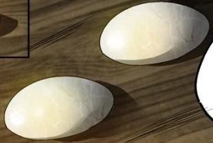

# The System
This system is based on the world of the xianxia novel Reverend Insanity (aka Master of Gu) by Gu Zhen Ren. In short, it is a high-magic system where most characters and all players are spellcasters called Gu Masters. Spells are contained within creatures called Gu, which can be stored inside a Gu Master's body. Each Gu has a specific function, and the way your character will play is going to constantly change as your personal collection of Gu changes. If you specialize in fire path and later decide you'd rather beat your enemies to death with strength path, you can sell your Gu and buy, find, or create new ones to fulfill that purpose, or dual cultivate the paths for a unique playstyle.

## The Aperture
The aperture is a sort of extra-dimensional space located in a Gu Master's stomach. Around the age of puberty, people can awaken their aperture by coming into contact with Hope Gu. Not everyone is lucky enough to be able to awaken their aperture, but those that do are henceforth called Gu Masters. People without an awakened aperture are called mortals, and are just regular people.

The aperture is a simple sphere bounded by walls and filled with a sea of primeval essence, a resource used to activate Gu as well as to cultivate. Cultivation consists of attacking your aperture walls with this primeval essence, eventually breaking them and moving on to a new realm. Gu Masters begin at rank 1 and can cultivate to rank 5. Each rank is considered a large realm, and are subdivided into 4 small realms: initial stage, middle stage, upper stage, and peak stage. After rank 5, there are still ranks 6 through 9, but that is the realm of Gu Immortals and the rules change massively. In this system, the maximum rank attainable is rank 5 peak stage.

You can store Gu in your aperture no matter their size, and there is no limit to the number of Gu that can be stored in your aperture.

## Primeval Essence
Primeval essence is the main resource used by Gu masters to activate and refine Gu as well as cultivate to increase their strength. The representation of primeval essence you see here is an approximation, as the resource quickly becomes quite complex when factoring in the rank and realm of the user alongside the rank of the Gu.

A Gu Master's aperture has a maximum amount of primeval essence, determined by their aptitude. At the initial stage of each rank, a Gu Master has a number of portions of primeval essence equal to their aptitude. A Gu Master at rank 2 initial stage with a 30% aptitude (D-Grade) has a maximum of 30 portions of primeval essence. 

When out of combat, the recovery rate is 10% of the Gu Master's maximum primeval essence every hour. Each small realm above initial stage doubles the maximum number of portions available.

At higher ranks, your primeval essence is significantly more potent than even peak stage of the rank below you. For simplicity, activating any Gu of a rank below your own costs a single portion of primeval essence.

As a bonus action, you may leak the aura of your primeval essence. Any creature within 10 meters of you can sense this aura and immediately identify the rank and stage of your primeval essence.

## Primeval Stones

Small, smooth stones naturally formed from primeval essence, primeval stones are the main currency in the Gu world. On your turn, you can absorb the essence of a number of primeval stones equal to the amount of hands you have as a **Combat Action** . You must have one hand free for each stone being absorbed.

For each primeval stone being absorbed, you gain 5 portions of primeval essence, and the stone is destroyed in the process, crumbling into dust.

## Refinement
Gu can be created out of materials and other Gu in a process called refinement. See the *Gu* chapter for more details.

# The World
The Gu world is a massive, flat disc, consisting of 5 regions. The source material is pretty inconsistent with size, but it is safe to say each region is at least 6 or 7 times the surface area of the Earth. The 5 regions are as follows:

- Northern Plains: Flat grassland dotted with nomadic tribes of various sizes. Conflict is commonplace and the Gu Masters here are the most adept at fighting.
- Western Desert: A dry wasteland with cities gathered around its oases. Lone cultivators are very uncommon.
- Southern Border: An uneven, mountainous region with familial clans settling on mountainsides. The setting of this system.
- Eastern Sea: Vast ocean dotted with archipelagos. Conflict is less common due to difficulty in reaching other settlements, allowing its inhabitants to focus on cultivation and gaining wealth. Many lone cultivators.
- Central Continent: The most powerful of the five regions and home to the Heavenly Court. Has a mix of the other four regions' geography (i.e. a normal continent).

Since the world is a disc, Southern Border does not border Northern Plains, but it does border the other regions. The same goes for the other outer regions, with only Central Continent connecting to all of them.

## Mortals
People without an awakened aperture cannot use Gu. Their status is very low, and in most places a Gu Master can outright kill any mortals that disrespect them. Despite that, mortals do a great deal of work to provide food and resources to the clan, and cannot be wantonly murdered without reproach from righteous path forces.

## Righteous and Demonic
Gu Masters identify as part of either the demonic path or righteous path. Demonic does not necessarily mean evil, just that the Gu Master does not follow the rigid systems of community. Of course, many demonic path Gu Masters ARE evil and more than willing to hurt the innocent to further their own goals. Similarly, righteous path Gu Masters are not necessarily good, they just follow the rules of society. While many have ideals of justice and virtue, the more powerful righteous path Gu Masters exploit this societal responsibility for their own gain, and are often willing to commit evil deeds to further their goals, just in more subtle ways than the demonic path.

## Setting
Given the size of the world and the fact that each region has its own local gu, flora, and fauna, I've chosen to localize this system to the Southern Border. You can certainly design a campaign in one of the other regions using this system as a framework, but there might be a great deal of work involved. If you're familiar with Reverend Insanity, this system is set during Fang Yuan's first life so as to give myself the most source material to work with for the setting. I suppose if you play for 500 in-game years the timeline would reset, but you can always just ignore that and pretend Fang Yuan died before going back in time.

Chapter 5 is dedicated to Southern Border, its clans, and geography. It is heavily recommended for the Game Master to read it.